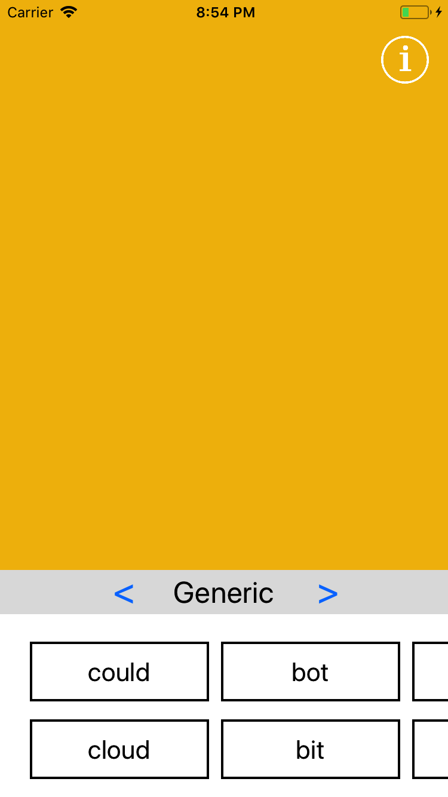
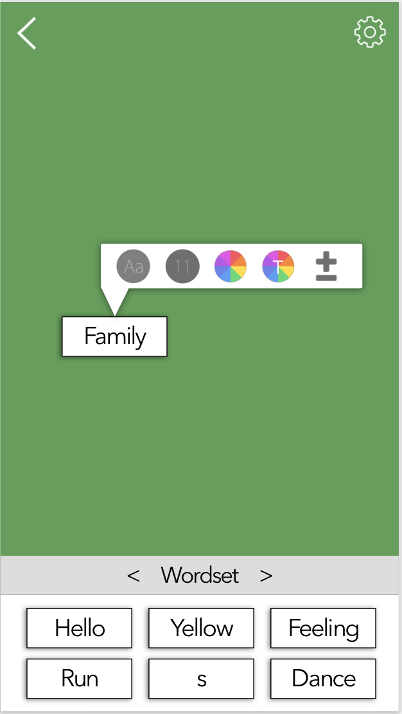
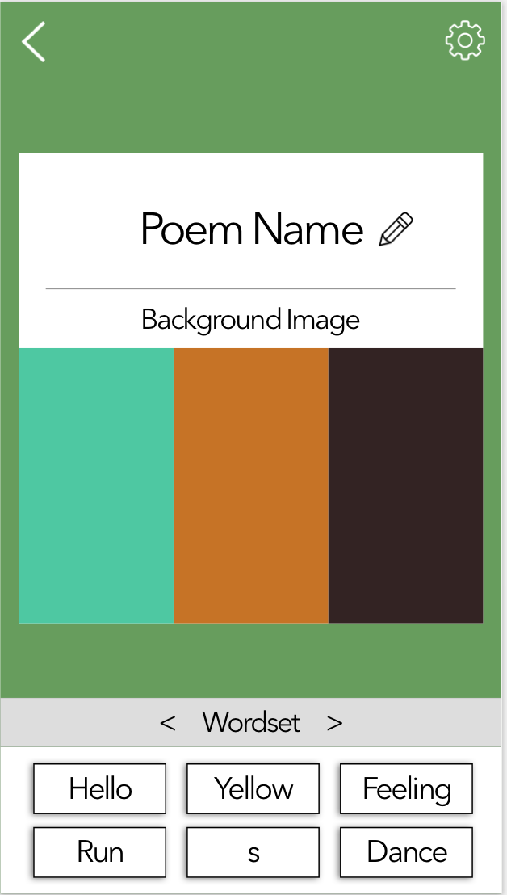
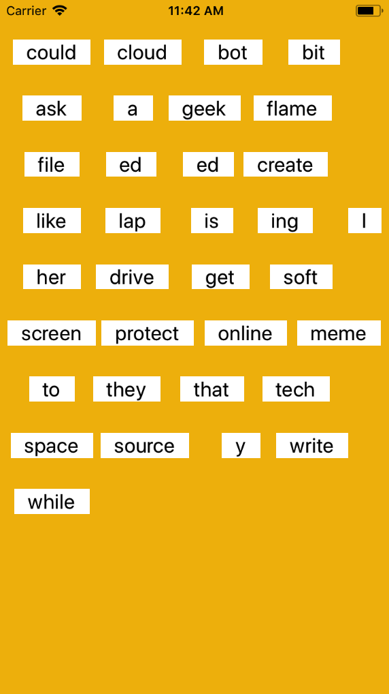
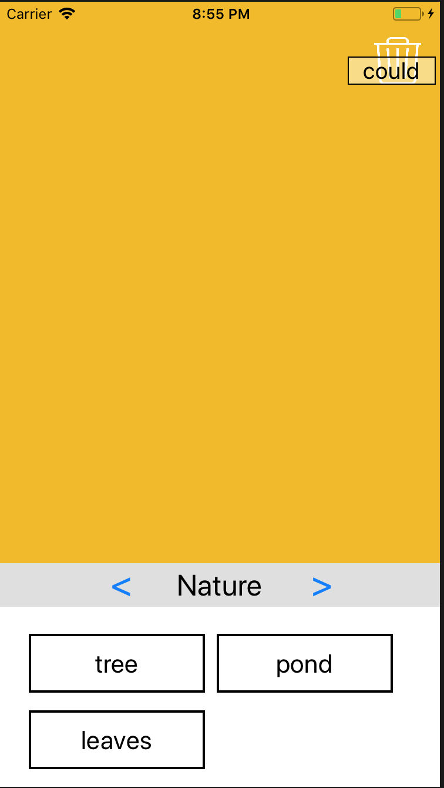
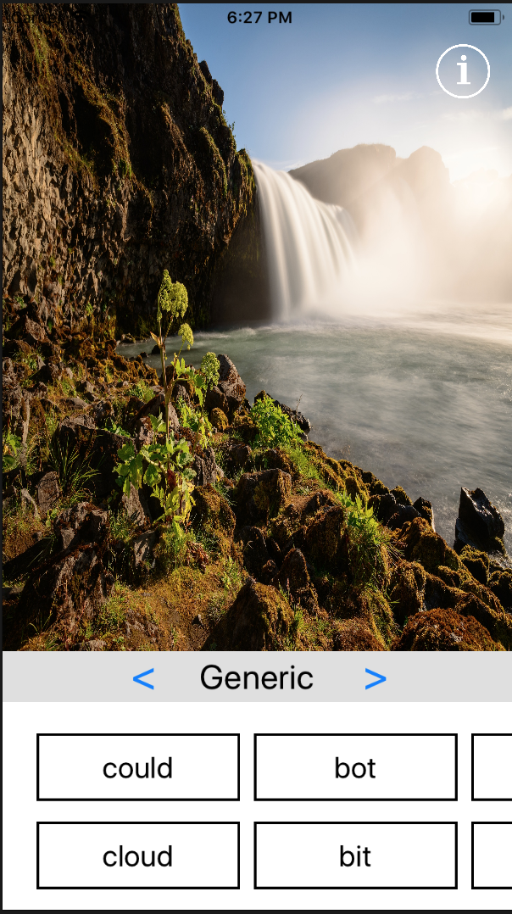
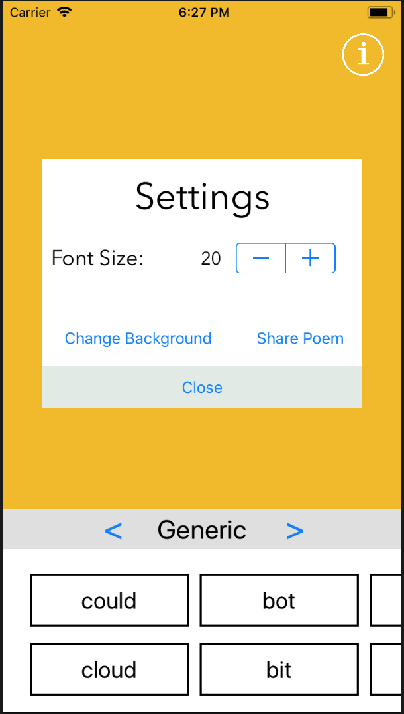

# FridgeMagnetPoetry
An iOS app that lets users create fridge poetry by moving and customizing words on the screen.

Jüri Kiin

Features:
1. Create poems with draggable customizable words
2. Be able to export poem images to social media (Instagram, Twitter)
3. Cycle through different word sets in the same poem for a more diverse selection

##Checkpoint 1:

1. Selected a color scheme for the base app

2. Created initial mockup designs for poem page

3. Phase 1 looks like this:

##Checkpoint 2:

1. User is able to select from multiple word-sets

2. Allow users to delete words by dragging them over the info button

##Current Features
Default words are neatly placed on screen to start the app. The user is able to drag words around with a pan gesture and move the words in any order they wish.

Users can select words from multiple word-sets, and cycle between the word-sets.
Users can also delete words by dragging them over the info button and releasing.
Animation added when longpressing a word from the bank.

The app currently can be used on iPad and iPhone.

##Checkpoint Final:

1. User is able to select a photo from their library and use it as the background photo

2. Users can open an info window to access settings of their poem

##Added Features
The users can adjust the font size of all words on the screen.
They can share the poem to social media. The share includes a description and a screenshot of their poem.
They can select a photo from their library and use it as the background of the canvas.

